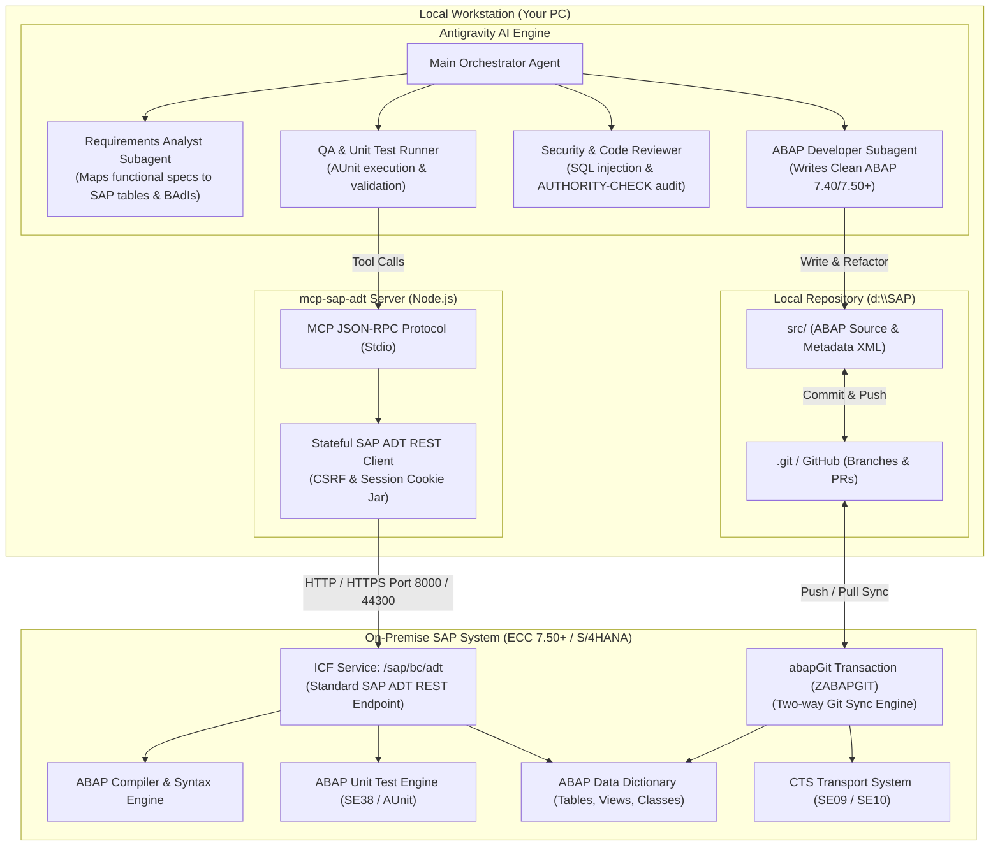

# How It Works: Autonomous On-Premise SAP ABAP Development with Antigravity & abapGit

This document explains the architecture, operational workflow, and full capabilities of the **AI-driven SAP ABAP Development Engine** running in this workspace (`d:\SAP`), specifically tailored for **On-Premise SAP ECC (7.40/7.50+) and On-Premise SAP S/4HANA**.

---

## 1. Executive Summary

Traditional SAP development requires developers to spend hours in `SE80`, `SE24`, or Eclipse writing boilerplate, running manual syntax checks, crafting unit tests, and coordinating transports.

This architecture brings modern, agile software engineering to On-Premise SAP:
* **No SAP BTP required:** Works 100% on your internal on-premise SAP landscape.
* **No commercial 3rd-party backend licenses:** Uses SAP's standard, built-in **ADT (ABAP Development Tools)** REST services.
* **Version controlled via abapGit:** Every line of code is tracked in Git, enabling pull requests, branch reviews, and audit trails.
* **Multi-agent AI pair programming:** Antigravity orchestrates requirements analysis, clean coding, security auditing, and automated testing.

---

## 2. Architecture Blueprint



---

## 3. How the 4 Layers Work Together

### Layer 1: AI Multi-Agent Intelligence (Antigravity)
When you give a prompt (e.g., *"Create a class to validate customer credit limits before posting orders"*):
1. **Requirements Analyst:** Identifies the required SAP data model (e.g., tables `VBAK`, `KNKK`, `VAPMA`, or CDS views), specifies method interfaces, and lists mandatory authorization checks (`V_VBAK_VKO`).
2. **ABAP Developer:** Generates or edits modern ABAP in `src/<class_name>.clas.abap` following Clean ABAP rules (constructor expressions `VALUE #()`, inline declarations, modular methods).
3. **Security Reviewer:** Scans for SQL injection risks, unsafe dynamic calls, missing client handling, and missing `AUTHORITY-CHECK` statements.
4. **QA Subagent:** Writes test doubles and unit test methods in `src/<class_name>.clas.locals_imp.abap`, then invokes the MCP tools.

### Layer 2: Local Version Control (abapGit & Git)
* All ABAP code is serialized as plain text files under `d:\SAP\src\`:
  * `.clas.abap`: Main class definition and global methods.
  * `.clas.locals_imp.abap`: Local classes, private helpers, and test classes.
  * `.clas.xml`: Object metadata (description, package, authorizations).
* You can create Git branches (`feature/credit-check`), open Pull Requests, and review diffs before code ever enters production.
* Inside your on-premise SAP GUI, transaction **`ZABAPGIT`** allows pulling or pushing code directly between your SAP package (`Z*`) and this Git repository.

### Layer 3: The MCP Bridge (`mcp-sap-adt`)
* Located at `d:\SAP\mcp-sap-adt\`, running as a local Node.js process managed by Antigravity via `C:\Users\rajee\.gemini\config\mcp_config.json`.
* **Standard Protocol:** Talks to `/sap/bc/adt` over HTTP (e.g. port 8000) or HTTPS (port 44300).
* **Stateful Sessions:** Automatically fetches and maintains SAP CSRF tokens (`X-CSRF-Token`) and session cookies (`SAP_SESSIONID_*`), allowing sequential locking $\rightarrow$ writing $\rightarrow$ activating $\rightarrow$ unlocking without disconnecting.
* **Non-Destructive Syntax Checks:** Validates code against the SAP compiler in-memory without saving incomplete or broken code to the SAP database.

### Layer 4: On-Premise SAP Backend
* **Native Compatibility:** Works with any SAP NetWeaver 7.40, 7.50+, or S/4HANA 1610–2023 on-premise system.
* **Standard Authorizations:** Uses the developer's standard SAP user and permissions (`S_DEVELOP`, `S_RFC_ADM`). No elevated root access required.

---

## 4. What We Can Do: Capabilities Matrix

| Capability | What It Does | Tool / Workflow |
|---|---|---|
| **1. Real-time Syntax Checking** | Validates ABAP code against the live SAP compiler without saving dirty code to SAP. Catches unknown types, syntax errors, and missing fields immediately. | `sap_check_syntax` |
| **2. Read Live Classes from SAP** | Pulls the active source code of any standard or custom class (`ZCL_*`, `CL_*`) directly into your local workspace. | `sap_read_class` |
| **3. Automated Unit Testing** | Executes ABAP Unit test suites on the SAP application server and parses test failures, assertion messages, and execution times. | `sap_run_unit_tests` |
| **4. Direct Buffer Write & Activation** | Writes updated code to the SAP inactive buffer and activates it in the SAP dictionary after review. | `sap_write_class`<br>`sap_activate_class` |
| **5. Legacy Code Modernization** | Refactors legacy ECC ABAP (e.g., header lines, `TABLES:`, nested `SELECT...ENDSELECT`, `MOVE-CORRESPONDING`) into modern 7.50+ functional ABAP. | `abap-developer` subagent |
| **6. Security & Vulnerability Audit** | Audits ABAP code for SQL injection, unsanitized user inputs, missing `AUTHORITY-CHECK`, and performance bottlenecks. | `abap-security` subagent |
| **7. Two-Way Git Synchronization** | Syncs local code changes with SAP packages via abapGit (`ZABAPGIT`), linking ABAP changes to GitHub/GitLab branches. | Git CLI + `ZABAPGIT` |

---

## 5. End-to-End Day-to-Day Workflow

```
┌─────────────────────────────────────────────────────────────────────────────┐
│  STEP 1: User Request                                                       │
│  "Add a new method calculate_tax_exemption to ZCL_BILLING_HELPER"          │
└──────────────────────────────────────┬──────────────────────────────────────┘
                                       ▼
┌─────────────────────────────────────────────────────────────────────────────┐
│  STEP 2: Pull Existing Code from On-Premise SAP                             │
│  Antigravity calls `sap_read_class` -> fetches latest ZCL_BILLING_HELPER    │
└──────────────────────────────────────┬──────────────────────────────────────┘
                                       ▼
┌─────────────────────────────────────────────────────────────────────────────┐
│  STEP 3: Multi-Agent Refactoring & Testing                                  │
│  1. Dev Agent implements method with modern 7.50 syntax                    │
│  2. QA Agent writes unit test cases with CL_AUNIT_ASSERT                    │
│  3. Security Agent verifies AUTHORITY-CHECK & SQL sanitization              │
└──────────────────────────────────────┬──────────────────────────────────────┘
                                       ▼
┌─────────────────────────────────────────────────────────────────────────────┐
│  STEP 4: Pre-Flight Syntax Check                                            │
│  Antigravity calls `sap_check_syntax` on SAP DEV -> Compiler returns: OK     │
└──────────────────────────────────────┬──────────────────────────────────────┘
                                       ▼
┌─────────────────────────────────────────────────────────────────────────────┐
│  STEP 5: User Confirmation Gate                                             │
│  Agent displays diff and asks: "Proceed to activate on SAP DEV?"            │
└──────────────────────────────────────┬──────────────────────────────────────┘
                                       ▼
┌─────────────────────────────────────────────────────────────────────────────┐
│  STEP 6: Activate & Sync                                                    │
│  1. Antigravity calls `sap_write_class` & `sap_activate_class`              │
│  2. Antigravity calls `sap_run_unit_tests` -> All tests PASS                │
│  3. Agent creates Git commit: `git commit -m "feat: add tax exemption"`    │
│  4. Changes are safely tracked in GitHub and synced via abapGit             │
└─────────────────────────────────────────────────────────────────────────────┘
```

---

## 6. How to Configure Your On-Premise Connection

Open `d:\SAP\mcp-sap-adt\.env` and configure your on-premise connection parameters:

```env
# URL of your On-Premise SAP Application Server (HTTP or HTTPS)
SAP_URL=http://sapdev.yourcompany.corp:8000

# Target Client (e.g. 100, 200, 300)
SAP_CLIENT=100

# Your SAP Developer Credentials
SAP_USER=DEVELOPER_USER
SAP_PASSWORD=YOUR_PASSWORD

# Language & SSL settings
SAP_LANGUAGE=EN
SAP_ALLOW_SELF_SIGNED=true
```

Then test connectivity in PowerShell:
```powershell
cd d:\SAP\mcp-sap-adt
npm run test:ping
```

Once connected, all 6 tools are immediately available to Antigravity.
