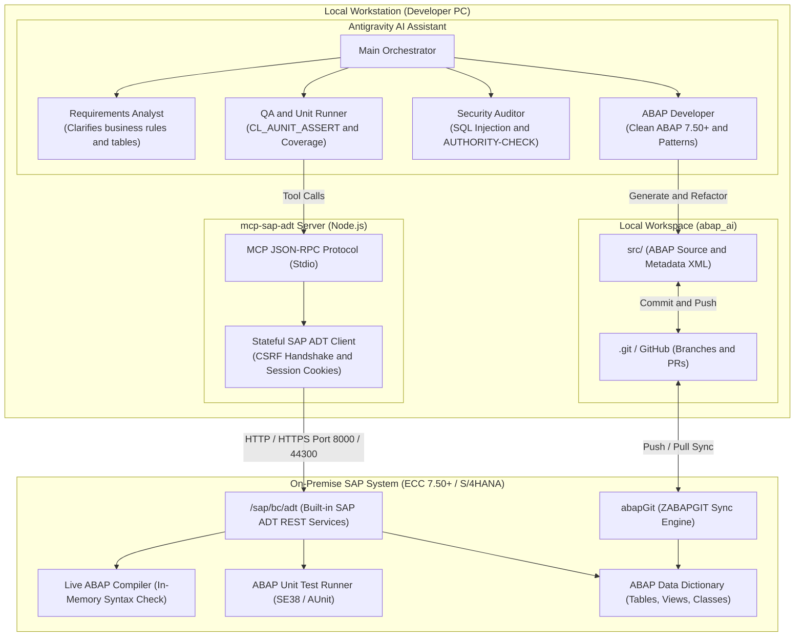
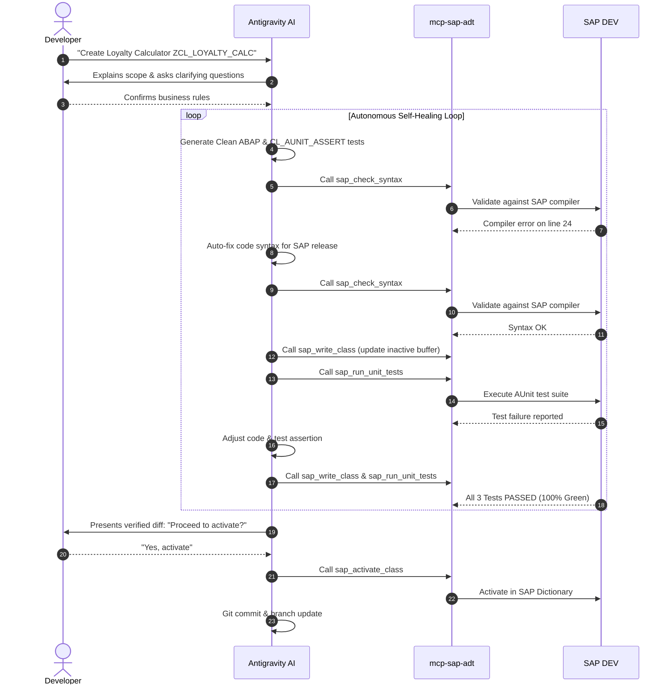

# abap_ai: Autonomous SAP ABAP Development Engine

> **Autonomous AI-Assisted Clean ABAP Development, Real-Time Compiler Verification, Automated Unit Testing, and abapGit Version Control for On-Premise SAP ECC 7.40/7.50+ and SAP S/4HANA.**

---

## Table of Contents
1. [Executive Overview](#executive-overview)
2. [Architecture Blueprint](#architecture-blueprint)
3. [1-Click Quickstart (Team Setup)](#1-click-quickstart-team-setup)
4. [SAP-Side Setup (SAP GUI Steps)](#sap-side-setup-sap-gui-steps)
5. [The Autonomous Closed-Loop Lifecycle](#the-autonomous-closed-loop-lifecycle)
6. [Real-World Code and Testing Walkthrough](#real-world-code-and-testing-walkthrough)
7. [MCP Toolset Reference](#mcp-toolset-reference)
8. [Repository Structure](#repository-structure)
9. [Enterprise Security and Basis Compliance](#enterprise-security-and-basis-compliance)

---

## Executive Overview

Traditional ABAP development forces developers into manual, repetitive cycles in SE80, SE24, or Eclipse: writing boilerplate, manually running syntax checks, struggling with unit tests, and coordinating transport conflicts.

**abap_ai** brings modern, autonomous software engineering to **On-Premise SAP**:
* **No SAP BTP Required:** Operates 100% on internal on-premise SAP ECC 7.40/7.50+ and S/4HANA systems.
* **Zero Backend Installs and Zero Licensing Fees:** Uses SAP's official, built-in **ADT (ABAP Development Tools)** REST services. No commercial 3rd-party transports required.
* **Automated Self-Healing Loop:** The AI writes code, validates syntax against the live SAP compiler, runs ABAP Unit tests, and **automatically fixes its own errors** until tests pass.
* **abapGit Version Control:** Clean, plaintext ABAP stored in Git branches, enabling code reviews, pull requests, and instant rollbacks.

---

## Architecture Blueprint



---

## 1-Click Quickstart (Team Setup)

When any team member clones this repository, they only need to run **one command** to set up dependencies, compile the MCP server, and configure Antigravity:

### On Windows (PowerShell):
```powershell
powershell -ExecutionPolicy Bypass -File .\setup.ps1
```

### On macOS / Linux / WSL:
```bash
chmod +x ./setup.sh && ./setup.sh
```

### What the Setup Script Automates:
1. Verifies the local **Node.js** runtime (v18+ or v20+).
2. Installs npm dependencies and compiles TypeScript (`npm run build`).
3. Automatically creates `mcp-sap-adt/.env` from template.
4. **Dynamically registers the `sap-adt` MCP server into Antigravity (`~/.gemini/config/mcp_config.json`)** with the absolute path on the developer's PC.

### Connect to Your SAP Instance:
Open `mcp-sap-adt/.env` and enter your on-premise SAP login:
```env
SAP_URL=http://your-sap-host.company.corp:8000
SAP_CLIENT=100
SAP_USER=YOUR_DEV_USER
SAP_PASSWORD=YOUR_PASSWORD
SAP_ALLOW_SELF_SIGNED=true
```

Test connection:
```powershell
cd mcp-sap-adt
npm run test:ping
```

---

## SAP-Side Setup (SAP GUI Steps)

No custom transports or basis imports are required. Simply verify two standard settings in SAP GUI:

### Step 1: Enable ADT in Transaction SICF
1. Log into your on-premise SAP DEV system via SAP GUI.
2. Open transaction **SICF**.
3. In **Service Path**, enter `/sap/bc/adt` and press **Execute (F8)**.
4. Expand the tree to `/default_host/sap/bc/adt`.
5. Ensure **adt** is active (black text). If grayed out, right-click **adt** -> **Activate Service** -> Select **Yes** (including subnodes).

```text
/default_host
  └── sap
      └── bc
          └── adt  <-- Must be ACTIVE
              ├── core/discovery     (Session and CSRF token handshake)
              ├── oo/classes         (Class read, write, and lock)
              ├── syntaxcheck        (In-memory compiler check)
              ├── activation         (Dictionary activation engine)
              └── abapunit           (AUnit test execution runner)
```

### Step 2: User Authorizations (SU01)
Ensure your developer user has:
* Authorization object **S_DEVELOP** (`OBJTYPE: CLAS, INTF, PROG`, `ACTVT: 01, 02, 03`).
* Authorization object **S_RFC_ADM** / **S_ICF** for HTTP access.

---

## The Autonomous Closed-Loop Lifecycle

Every development task follows an automated, self-healing quality loop defined in `.agents/skills/abap-dev-lifecycle/SKILL.md`:



---

## Real-World Code and Testing Walkthrough

Here is a concrete demonstration of how the AI writes modern, clean ABAP with corresponding unit tests:

### 1. The ABAP Class (`src/zcl_loyalty_calc.clas.abap`)
```abap
CLASS zcl_loyalty_calc DEFINITION PUBLIC FINAL CREATE PUBLIC.
  PUBLIC SECTION.
    TYPES: tv_tier TYPE c LENGTH 3.
    
    METHODS calculate_points
      IMPORTING
        iv_amount        TYPE p DECIMALS 2
        iv_tier          TYPE tv_tier DEFAULT 'STD'
      RETURNING
        VALUE(rv_points) TYPE i
      RAISING
        cx_dynamic_check.
ENDCLASS.

CLASS zcl_loyalty_calc IMPLEMENTATION.
  METHOD calculate_points.
    IF iv_amount <= 0.
      RAISE EXCEPTION TYPE cx_dynamic_check.
    ENDIF.

    DATA(lv_multiplier) = COND i( WHEN iv_tier = 'VIP' THEN 20 ELSE 10 ).
    rv_points = iv_amount * lv_multiplier.
  ENDMETHOD.
ENDCLASS.
```

### 2. The ABAP Unit Test Suite (`src/zcl_loyalty_calc.clas.locals_imp.abap`)
```abap
CLASS ltcl_loyalty_test DEFINITION FINAL FOR TESTING
  DURATION SHORT
  RISK LEVEL HARMLESS.
  PRIVATE SECTION.
    DATA mo_cut TYPE REF TO zcl_loyalty_calc.
    METHODS setup.
    METHODS test_standard_tier FOR TESTING.
    METHODS test_vip_tier FOR TESTING.
    METHODS test_negative_amount FOR TESTING.
ENDCLASS.

CLASS ltcl_loyalty_test IMPLEMENTATION.
  METHOD setup.
    mo_cut = NEW #( ).
  ENDMETHOD.

  METHOD test_standard_tier.
    DATA(lv_pts) = mo_cut->calculate_points( iv_amount = '100.00' iv_tier = 'STD' ).
    cl_aunit_assert=>assert_equals( exp = 1000 act = lv_pts msg = 'Standard points mismatch' ).
  ENDMETHOD.

  METHOD test_vip_tier.
    DATA(lv_pts) = mo_cut->calculate_points( iv_amount = '100.00' iv_tier = 'VIP' ).
    cl_aunit_assert=>assert_equals( exp = 2000 act = lv_pts msg = 'VIP points mismatch' ).
  ENDMETHOD.

  METHOD test_negative_amount.
    TRY.
        mo_cut->calculate_points( iv_amount = '-50.00' ).
        cl_aunit_assert=>fail( msg = 'Expected exception for negative amount' ).
      CATCH cx_dynamic_check.
        " Test passed - expected exception caught
    ENDTRY.
  ENDMETHOD.
ENDCLASS.
```

### 3. Live Test Output Returned by MCP
```json
{
  "totalTests": 3,
  "passed": 3,
  "failed": 0,
  "errors": 0,
  "classes": [
    {
      "className": "LTCL_LOYALTY_TEST",
      "methods": [
        { "name": "TEST_STANDARD_TIER", "status": "passed", "executionTime": 0.012 },
        { "name": "TEST_VIP_TIER", "status": "passed", "executionTime": 0.010 },
        { "name": "TEST_NEGATIVE_AMOUNT", "status": "passed", "executionTime": 0.008 }
      ]
    }
  ]
}
```

---

## MCP Toolset Reference

The local `sap-adt` MCP server exposes 6 core tools over stdio JSON-RPC:

| Tool Name | Parameters | Purpose |
|---|---|---|
| **sap_ping** | None | Verifies network connectivity and CSRF token handshake with SAP. |
| **sap_read_class** | className | Fetches active ABAP source code, definitions, implementations, and test classes. |
| **sap_check_syntax** | className, source | Validates ABAP code against the live SAP compiler without saving dirty states. |
| **sap_write_class** | className, source | Locks class via stateful session, writes buffer to inactive version, and unlocks. |
| **sap_activate_class** | className | Activates inactive ABAP class in the SAP Data Dictionary. |
| **sap_run_unit_tests** | className | Executes ABAP Unit test suite on SAP application server and parses results. |

---

## Repository Structure

```text
abap_ai/
├── .abapgit.xml                         # abapGit configuration
├── .gitignore                           # Excludes .env, node_modules, and dist
├── GEMINI.md                            # Clean ABAP rules and security governance
├── HOW_IT_WORKS.md                      # Detailed technical architecture guide
├── README.md                            # Complete setup and operational guide
├── setup.ps1                            # 1-Click setup script (Windows PowerShell)
├── setup.sh                             # 1-Click setup script (macOS/Linux/WSL)
├── .agents/skills/abap-dev-lifecycle/   # Autonomous self-healing lifecycle skill
│   └── SKILL.md
├── mcp-sap-adt/                         # Local SAP ADT MCP Server
│   ├── package.json
│   ├── tsconfig.json
│   ├── .env.example                     # Credential template
│   └── src/
│       ├── index.ts                     # Stdio transport and tool registration
│       ├── sap-adt-client.ts            # CSRF token and session cookie client
│       ├── types.ts                     # TypeScript schemas
│       └── test-ping.ts                 # Connection test script
└── src/                                 # Plaintext ABAP code and abapGit metadata
    ├── package.devc.xml
    ├── zcl_hello_btp.clas.abap
    └── zcl_hello_btp_test.clas.abap
```

---

## Enterprise Security and Basis Compliance

* **Zero Basis Friction:** Uses standard SAP ADT services delivered out-of-the-box by SAP NetWeaver. No custom Z-transports or proprietary code installed on your production or QA systems.
* **Granular SAP Permissions:** The MCP server operates strictly under the logged-in user's SAP developer credentials (S_DEVELOP). It cannot bypass SAP authorization boundaries.
* **Credential Isolation:** Passwords and tokens reside exclusively in local `mcp-sap-adt/.env`, which is strictly ignored by `.gitignore` and never committed to Git.
* **Human-in-the-Loop Activation Gate:** The AI is prohibited by rule from activating code in the SAP dictionary without explicit developer confirmation.

---

## Contributing and Team Workflow

1. Create a feature branch: `git checkout -b feature/my-new-class`
2. Open Antigravity and prompt your changes.
3. Allow the AI to run the autonomous syntax and unit test verification loop.
4. Review the diff and approve activation.
5. Commit and push:
   ```bash
   git add src/
   git commit -m "feat(sales): implement loyalty points calculator"
   git push origin feature/my-new-class
   ```
6. Open a Pull Request on GitHub for team review.

---

## Documentation Links
* [End-to-End Workflow and Capabilities Guide](file:///d:/SAP/END_TO_END_GUIDE.md)
* [Developer Onboarding and Setup Guide (Windows and Mac)](file:///d:/SAP/DEVELOPER_GUIDE.md)
* [Technical Architecture and Capabilities Reference](file:///d:/SAP/HOW_IT_WORKS.md)
* [Clean ABAP Guidelines and Quality Safeguards](file:///d:/SAP/GEMINI.md)
* [Autonomous Lifecycle Skill Specification](file:///d:/SAP/.agents/skills/abap-dev-lifecycle/SKILL.md)


