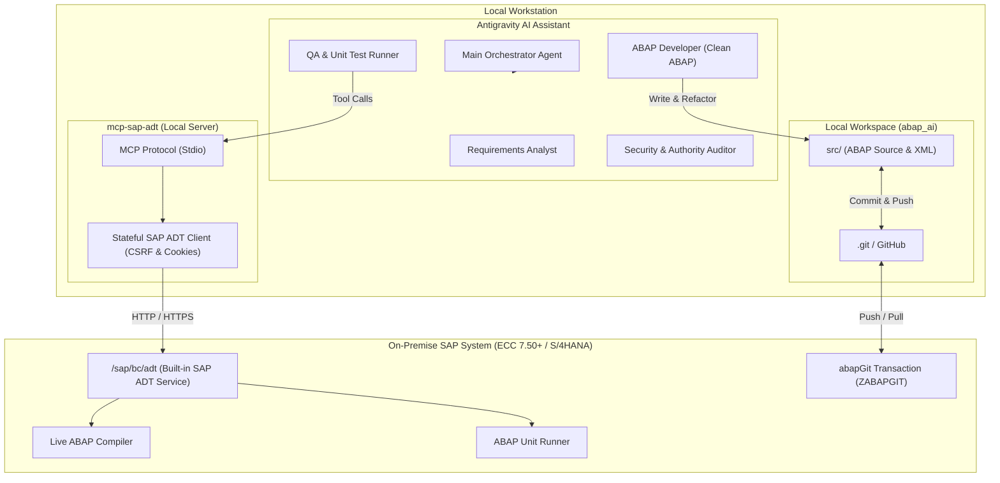

# abap_ai: Autonomous SAP ABAP Development Engine

> **AI-assisted Clean ABAP development, real-time compiler verification, automated unit testing, and abapGit version control for On-Premise SAP ECC 7.40/7.50+ & SAP S/4HANA.**

---

## ⚡ 1-Click Quickstart for Team Members

When any team member clones this repository, they only need to run **one command** to set up everything automatically:

### On Windows (PowerShell):
```powershell
powershell -ExecutionPolicy Bypass -File .\setup.ps1
```

### On macOS / Linux / WSL:
```bash
chmod +x ./setup.sh && ./setup.sh
```

### What the setup script does automatically:
1. Verifies the Node.js runtime.
2. Installs dependencies and compiles the `sap-adt` MCP server.
3. Creates the local `.env` configuration file.
4. **Automatically registers the `sap-adt` MCP server into Antigravity (`~/.gemini/config/mcp_config.json`)** with the exact dynamic path on their PC.

After running the script, add your on-premise SAP login in `mcp-sap-adt/.env`, open the project in Antigravity, and start coding!

---

## 🏛️ System Architecture



---

## 🔄 The Autonomous Self-Healing Lifecycle

When you request a feature or bug fix, the AI executes a closed-loop procedure:

1. **Explain & Clarify:** Analyzes the business requirement and asks targeted edge-case questions.
2. **Code & Test Authoring:** Writes modern Clean ABAP in `src/` and unit tests with `CL_AUNIT_ASSERT`.
3. **Automated Loop on SAP DEV:**
   * Runs `sap_check_syntax` on SAP $\rightarrow$ if syntax errors exist, automatically diagnoses and fixes them.
   * Runs `sap_run_unit_tests` on SAP $\rightarrow$ if assertions fail, automatically adjusts the code and re-tests.
   * Repeats until **0 errors** and **100% test pass rate**.
4. **User Review Gate:** Presents the clean diff and test summary for your approval before activating on SAP and committing to Git.

---

## 📁 Repository Structure

```text
abap_ai/
├── .abapgit.xml                         # abapGit configuration
├── .gitignore                           # Protects secrets (.env) and node_modules
├── GEMINI.md                            # Clean ABAP rules & governance
├── HOW_IT_WORKS.md                      # Comprehensive architecture guide
├── README.md                            # Quickstart & overview
├── setup.ps1                            # 1-Click setup for Windows
├── setup.sh                             # 1-Click setup for macOS/Linux/WSL
├── .agents/skills/abap-dev-lifecycle/   # Autonomous self-healing skill
│   └── SKILL.md
├── mcp-sap-adt/                         # Local SAP ADT MCP Server
│   ├── package.json
│   ├── tsconfig.json
│   ├── .env.example
│   └── src/
│       ├── index.ts                     # MCP stdio server & tool registry
│       ├── sap-adt-client.ts            # CSRF token & session cookie client
│       ├── types.ts                     # TypeScript schemas
│       └── test-ping.ts                 # Connectivity test script
└── src/                                 # ABAP source files & package metadata
    ├── package.devc.xml
    ├── zcl_hello_btp.clas.abap
    └── zcl_hello_btp_test.clas.abap
```

---

## 📚 Documentation
* [How It Works & Capabilities](file:///d:/SAP/HOW_IT_WORKS.md)
* [Coding Guidelines & Clean ABAP Rules](file:///d:/SAP/GEMINI.md)
* [Autonomous Dev Lifecycle Skill](file:///d:/SAP/.agents/skills/abap-dev-lifecycle/SKILL.md)
